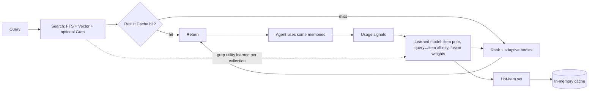
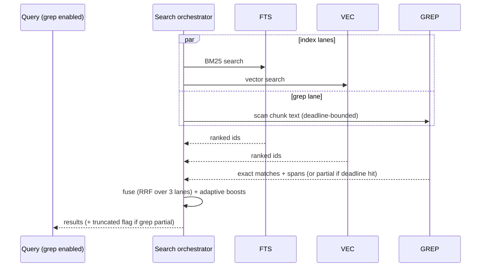

# small-memory — Design Addendum 2: Adaptive Index Tuning, In-Memory Cache & Optional Grep

> Addendum to `docs/small-memory-design.md` (base) and the host-LLM/skill addendum.
> Covers three features:
> 1. **Usage-driven adaptive ranking & index tuning** — learn from how memories are searched and used, and adjust the index/ranking accordingly.
> 2. **In-memory cache** — cache the top ~100 hot entries; evict by LRU or invalidate when the source data changes.
> 3. **Optional grep lane** — run a literal/regex scan over chunk text in parallel with normal search.
>
> - Status: Draft (v0.1)
> - Depends on: design §6 (storage/block cache), §7 (indexes), §8 (search/fusion/scoring), §9 (chunks), and Addendum 1 (host delegation, usage reporting)

---

## 0. How the three features fit together

These are not three isolated knobs; they form one retrieval-improvement loop:



- **Feature 1** turns real usage into ranking/index adjustments.
- **Feature 2** caches the assembled results and the hottest items; Feature 1 decides which items are "hot" enough to keep warm.
- **Feature 3** adds an exact-match lane; whether it helps a given collection is itself *learned* by Feature 1, and its results are cached by Feature 2.

Design invariants shared by all three (consistent with base non-negotiables):
- **Cold start = base behavior.** With no signals/cache, results are identical to the base engine (design §8). Nothing degrades day one.
- **Bounded & explainable.** Every adjustment is capped, decaying, visible in `--explain`, and resettable.
- **Never stale, never blocking.** The cache never returns data older than the latest write; grep is deadline-bounded and returns partial results rather than stalling.

---

## 1. Feature 1 — Usage-Driven Adaptive Ranking & Index Tuning

**Goal.** A memory's *purpose* and *how it gets found* become clear only once it is searched and used. Capture those signals and feed them back so that, for a given collection, the index and ranking drift toward what is actually useful — without a heavy ML training loop, and without locking the system into a popularity bubble.

This is deliberately a **deterministic, online, bounded** mechanism (counts + smoothing + decay), not a learned neural re-ranker. It fits the "lightweight, local, explainable" ethos and needs no extra model.

### 1.1 Signals & capture

Three signal sources, cheapest first:

| Signal | Meaning | Source |
|---|---|---|
| **Impression** | Item appeared in the top-k for a query | Recorded by the search layer automatically |
| **Usage** | Item was actually consumed (read in full / cited / acted on) | Reported by the agent (preferred) or inferred |
| **Explicit feedback** | Item marked useful / not useful for a query | `memory_feedback` tool |

**Attribution in an agent context.** In MCP/host-delegated mode the driving agent knows exactly which retrieved memories it used. So the primary capture path is an explicit call:

```
memory_record_usage(query_id, memory_ids[], outcome=used|cited|ignored)
```

The `/small-memory` skill instructs the host model, after a recall, to report which memory IDs it actually grounded its answer on. This is the cleanest signal and uses the host's own judgment (Addendum 1, §2). Fallbacks when the agent doesn't report:
- **Implicit click**: a `memory_get`/`memory_recall` for a specific ID shortly after a search in the same session is attributed to that search's `query_id`.
- **No signal**: impression-only; the item still accrues exposure but no usage credit.

**What we store (not raw text).** A compact, append-only event log + rolling aggregates:
- `query_id`, timestamp, collection, **tokenized query terms** (analyzer output, not the raw string), the candidate set IDs (impressions), and usage events.
- Privacy: query terms can be hashed per `tuning.hash_terms = true`; events are local-only; retention is capped (`tuning.retention`). Tombstoned items' signals are purged (provenance link).

### 1.2 The learned model

Three aggregates, all per collection, all time-decayed with a configurable half-life:

**(a) Item usage prior `u(d)`** — query-independent usefulness.
- Smoothed rate: `u(d) = (used(d) + α) / (impressions(d) + α + β)` (Bayesian/Wilson-style smoothing so an item with 1 lucky hit isn't overweighted).
- Time-decayed: older events count less (`half_life_prior`). Ties into existing `importance`/`access_count` (design §5, §8.3) — the prior *augments*, never replaces, author-set importance.

**(b) Query-term ↔ item affinity `a(t, d)`** — the core "purpose learning."
- For each query term `t` that co-occurred with item `d` being *used*, accumulate a decayed, normalized weight (a PMI-like score: reward co-use, discount terms that co-occur with everything).
- Stored sparsely and **bounded**: keep only the top-N items per term and top-M terms per item; evict the smallest. This caps memory and prevents unbounded growth.
- Interpretation: this learns, from real logs, the language people use to find an item — a log-derived form of document expansion.

**(c) Adaptive fusion & field weights** — per collection.
- Track which retrieval *lane* (FTS / vector / grep) and which *field* (title/body/tag) produced the **used** results, and nudge the RRF weights / BM25 field boosts toward the productive lane via a slow EMA, **clamped** to a band around the defaults (e.g. ±30%). If vector hits are consistently the useful ones for a collection, vector weight rises — but never to the point of silencing FTS.

### 1.3 Application at query time

Adaptive influence is an **additive, clamped boost** on top of the base score (design §8.3), never a replacement:

```
final(d) = base(d)
         + w_prior   · u(d)
         + w_affinity · Σ_{t ∈ query} a(t, d)
         + adaptive_fusion_term
```

Guards that make this safe:
- **Boost cap.** The total adaptive contribution is capped relative to `base(d)` (e.g. ≤ `cap·base`). An item with ~zero base relevance can never be hauled into the top-k by affinity alone beyond a small ceiling — this prevents "learned hallucinated relevance."
- **Exploration ε.** A small fraction of slots (or a small score jitter) is reserved for non-boosted candidates so new/unused items can earn impressions and break out of the popularity bubble. Configurable; defaults conservative.
- **Cold start.** Zero signals → all boost terms are 0 → identical to base ranking.

### 1.4 Index-side adjustments (literally tuning the index)

Beyond runtime re-ranking, the learned model feeds three concrete index/storage adjustments:

1. **Learned query expansion (runtime, cheap).** At query time, the top affinity terms for the query can expand the FTS query with low weight (synonym-like), so an item learns to match the vocabulary people actually use. No segment rewrite; bounded by the affinity table.
2. **Hot-item pinning (storage).** High-`u(d)` items are pinned into the in-memory cache (Feature 2) and their index blocks are kept resident in the block cache (design §6.3), so the useful items are the warm ones.
3. **Compaction-time materialization (optional).** During background compaction (design §6.2), learned expansions/weights for stable, high-confidence items may be *materialized* into the segment (e.g., added postings or a stored boost), making the adjustment durable and free at query time. Gated behind confidence thresholds and reversible by reset+recompaction.

### 1.5 Lifecycle

- **Storage.** A separate `tuning` namespace (its own bbolt tables / small DB), independent of immutable segments so it never violates LSM immutability. Exported/imported with the store (design §6.1).
- **Decay schedule.** A background job applies time-decay and prunes the bounded tables (top-N/top-M) on a cadence.
- **Invalidation.** On `memory_forget`/`memory_merge`, drop the affected items' priors and affinity entries (provenance link).
- **Reset.** `smem tuning reset [--collection c]` clears all learned signals → instant return to base behavior. `smem tuning export/import` for portability and inspection.

### 1.6 Explainability & feedback-loop safety

- `--explain` shows, per result, the base score and each boost contribution (`u`, affinity terms, fusion delta), so a human can see *why* an item rose.
- Reward is the dominant force; "ignored" impressions cause only mild discounting, never aggressive demotion (avoids burying items that simply haven't been needed yet).
- All weights/half-lives/caps/ε are config; the whole subsystem is `tuning.enabled = false`-able per collection.

### 1.7 Data model (sketch)

```go
type UsageEvent struct {
    QueryID    ULID
    Collection string
    Terms      []TermID    // analyzer tokens (optionally hashed)
    Impressions []ChunkID
    Used        []ChunkID
    At          time.Time
}

type ItemPrior struct{ Used, Impr float64; Decayed time.Time } // → u(d)
type Affinity  map[TermID]map[ChunkID]float64                  // bounded top-N/M
type FusionWeights struct{ FTS, Vector, Grep float64 }          // clamped band
```

---

## 2. Feature 2 — In-Memory Cache (top ~100, LRU + write-invalidation)

**Goal.** Avoid recomputing/rehydrating the same hot results. Cache the top ~100 hot entries; evict by LRU or invalidate when the underlying data changes.

This sits **above** the existing block cache (design §6.3, which caches index *blocks*). This new cache caches *assembled answers* and *hydrated hot items*.

### 2.1 Two cooperating tiers

| Tier | Caches | Capacity | Eviction |
|---|---|---|---|
| **R — Result cache** | Assembled top-k result sets keyed by query signature | ~100 query signatures (configurable) | LRU + generation invalidation |
| **H — Hot-item cache** | Fully hydrated memory/chunk records for the hottest items | ~100 items (the "top 100") | LRU, pinned by Feature 1's `u(d)` |

Tier R serves repeat/similar queries from agents; Tier H guarantees the most-used items are always in RAM (warmed by Feature 1). Both are bounded and cheap.

### 2.2 Key & value

- **Result cache key** = hash of `{collection, normalized query, filters, mode (fts/vector/hybrid/grep flags), k, tuning_epoch}`. Normalization uses the same analyzer normalization as search so trivially-different queries share an entry.
- **Result cache value** = ordered `[]ChunkID` + scores + score breakdown (not full text); full text is fetched from Tier H or storage on read. Keeps entries tiny.
- **Hot-item value** = the hydrated record (content + metadata), size-bounded.

### 2.3 Invalidation — correctness first

The hard requirement is **never return data older than the latest write**. We use a **per-collection generation counter** rather than scanning:

- Each collection holds a monotonically increasing `generation`, bumped on **any** write (`store`/`update`/`merge`/`forget`/compaction that changes visibility).
- Every result-cache entry records the `generation` it was computed under. On lookup, if `entry.generation != collection.generation`, it's a **miss** (logically invalidated) — O(1), no scan.
- For finer granularity, writes that touch specific items also push those `ChunkID`s into Tier H's targeted-invalidation set so hydrated copies are dropped immediately.
- The `tuning_epoch` in the key means a `tuning reset` or significant model change cleanly invalidates ranking-dependent entries too.

LRU handles capacity; the generation counter handles freshness. Together they satisfy "evict by LRU **or** on source update" with zero risk of stale reads.

### 2.4 Capacity, memory, concurrency

- Hard entry caps (default 100 each) **and** a byte budget; whichever binds first triggers LRU eviction. Counts against the global memory budget (design N2).
- Read-heavy: a sharded/striped LRU (lock per shard) to avoid contention; lock-free fast path on hit where feasible.
- Metrics: hit rate, evictions, invalidations surfaced in `smem stats` (design §8.4 / observability).

### 2.5 Interaction with Feature 1 and the block cache

- Feature 1's `u(d)` decides Tier H membership (usage-aware warming), turning "top 100" into "top 100 *most useful*," not merely most recent.
- The block cache (design §6.3) remains the lower layer for index data; a result-cache miss still benefits from warm blocks. The three caches are layered, not redundant.

---

## 3. Feature 3 — Optional Grep Lane

**Goal.** Run a literal/regex scan over chunk text **in parallel** with normal search, as an option. Grep covers exactly what BM25 and vectors are weak at: exact identifiers, code symbols, error strings, rare tokens, and regex patterns — high value for coding agents.

### 3.1 Engine

- **Pure Go primary** (honors single-binary, CGO-free default, design N1):
  - **Literal** patterns → fast substring scan (`bytes.Contains` / Boyer–Moore-style; consider SIMD memchr-like helpers).
  - **Regex** patterns → Go `regexp` (RE2): linear-time, no catastrophic backtracking, safe to expose to agents.
- **Optional external `ripgrep`** acceleration behind a build tag/feature flag for very large local stores; never required, never in the default build.

### 3.2 Parallel execution & deadline



- Runs as a concurrent lane via `errgroup`, sharing the query's `context` deadline. If the scan can't finish within the budget, it returns **partial results** and a `grep_truncated=true` flag rather than stalling the response.
- Scans chunk text from storage, preferring blocks already warm in the block cache; honors metadata/path/type filters to bound the scan set.

### 3.3 Fusion & highlights

- Grep is added as a **third ranker in RRF** (design §8.2): FTS, vector, grep. RRF handles N lists natively, so exact matches get strong but bounded influence without fragile score normalization.
- Grep's unique advantage — **exact match spans/offsets** — is returned as highlights, useful for the agent to quote precisely.

### 3.4 Options & scope control

- Per-query: `--grep` (or `mode` includes grep), `--regex`, `--case-sensitive`, `--word`, plus filters to limit the scan.
- Per-collection default and a `grep.max_scan_bytes` / `grep.deadline` budget.
- **Default off** ("an option"). Feature 1 can *learn* to auto-enable grep for a collection where grep matches are frequently the used ones (e.g., identifier-heavy queries).

### 3.5 Performance & future acceleration

- For "small" scale, deadline-bounded linear scan over warm blocks is adequate.
- Future accel (note, not v1): a **trigram index** (RE2 + trigram filtering, Code-Search style) to prune candidate chunks before scanning — large speedup for regex over big stores. Keep behind a flag; build only if benchmarks justify it (design D4 ethos).

---

## 4. Configuration

```toml
[tuning]                       # Feature 1
enabled = true
hash_terms = false
retention = "90d"
half_life_prior = "30d"
half_life_affinity = "21d"
w_prior = 0.15
w_affinity = 0.20
boost_cap = 0.5                # max adaptive contribution as a fraction of base
exploration_epsilon = 0.05
affinity_top_items_per_term = 32
affinity_top_terms_per_item = 32
fusion_weight_band = 0.30      # ± clamp around defaults
materialize_on_compaction = false

[cache]                        # Feature 2
result_entries = 100
hot_items = 100
byte_budget_mb = 32            # counts toward global memory budget
shards = 16

[grep]                         # Feature 3
default = false
deadline = "150ms"
max_scan_bytes = "64MiB"
use_ripgrep = false            # optional external accel (build tag)
```

---

## 5. MCP / CLI surface changes

**MCP tools (additions).**
- `memory_record_usage(query_id, memory_ids[], outcome)` — feeds Feature 1 (called by the skill).
- `memory_feedback(query_id, memory_id, useful)` — explicit feedback.
- `memory_recall`/`memory_search` gain optional `grep`, `regex`, and return a `query_id` (so usage can be attributed) plus `grep_truncated` and highlight spans.

**Skill (`/small-memory`).** After a recall, the skill instructs the host model to call `memory_record_usage` with the IDs it actually used. `/small-memory recall --grep <pattern>` exposes the grep lane.

**CLI.**
- `smem search … [--grep] [--regex] [--case-sensitive] [--explain]` (explain now shows adaptive boosts).
- `smem tuning {stats|reset|export|import} [--collection c]`.
- `smem stats` reports cache hit/miss/eviction/invalidation and tuning model size.

---

## 6. Testing & acceptance

**Feature 1**
- Cold start: with no signals, ranking is byte-identical to base (golden test).
- Boost cap: a near-zero-base item with high affinity cannot exceed the cap (property test).
- Decay: signals age out per half-life (deterministic clock injection).
- Invalidation: deleting/merging items purges their priors/affinities.
- Reset: `tuning reset` restores base ranking exactly.
- Explainability: `--explain` emits per-result boost breakdown.
- No feedback loop runaway: simulate repeated self-reinforcement; assert exploration keeps fresh items reachable.

**Feature 2**
- **Freshness (critical):** after any write that changes a collection, a previously cached query for that collection MUST miss (generation-counter test). No stale read under concurrent writes (`-race` + fuzz).
- LRU eviction at capacity; byte-budget eviction.
- Hot-item tier is warmed by `u(d)` (Feature 1 integration test).
- Hit-rate metrics exposed in stats.

**Feature 3**
- Literal and RE2 regex correctness vs a brute-force oracle.
- Parallelism: grep runs concurrently with index lanes; total latency ≈ max(lane), not sum.
- Deadline: oversized scan returns partial results with `grep_truncated=true`, never hangs.
- Fusion: RRF over 3 lanes is deterministic; exact spans returned.
- Default-off respected; `use_ripgrep` excluded from default build.

**Definition of Done**
- Cold start equals base behavior for all three features.
- Cache never returns data older than the latest write (proven under concurrency).
- Grep is deadline-bounded, parallel, optional, pure-Go in the default build.
- Adaptive tuning is bounded, decaying, explainable, and resettable; usage is captured via the skill in a real Claude Code session and demonstrably changes ranking on a seeded scenario.
- All builds pass `CGO_ENABLED=0` for every target; `make fmt lint test` green with `-race`.

---

## 7. Decision log (this addendum)

| # | Decision | Rationale |
|---|---|---|
| A1 | Adaptive tuning is deterministic counts + smoothing + decay, not a trained model | Lightweight, local, explainable; no extra model to ship or run. |
| A2 | Adjustments are additive, capped boosts over base score, never replacements | Prevents "learned hallucinated relevance"; base relevance stays authoritative. |
| A3 | Exploration ε reserved | Avoid popularity/filter-bubble lock-in; let new items earn signals. |
| A4 | Usage captured primarily via explicit agent reporting (`memory_record_usage`) | The host model knows what it used; aligns with host-delegation (Addendum 1). |
| A5 | Tuning lives in a separate store, decayed/bounded/resettable | Never violates segment immutability; bounded memory; easy rollback. |
| A6 | Cache freshness via per-collection generation counter (+ targeted item invalidation) | O(1) correctness; "LRU or on-update" with zero stale-read risk. |
| A7 | Two cache tiers (result + hot-item), hot set chosen by usage | "Top 100" = top 100 *useful*, not merely recent; warms the right data. |
| A8 | Grep is pure-Go (literal + RE2), parallel, deadline-bounded, optional; rg behind a build tag | Honors single-binary/CGO-free default; safe regex; never stalls. |
| A9 | Grep fused as a third RRF lane with exact-span highlights | Natural N-list fusion; exposes grep's exact-match advantage. |
| A10 | Feature 1 may learn to auto-enable grep per collection | Closes the loop: grep utility is measured, not guessed. |

---

*Open questions: (a) whether to surface a small "why did this rank here?" trace to the agent by default (vs only under `--explain`); (b) trigram-accelerated grep — build only if benchmarks on large local stores justify it; (c) cross-collection global priors vs strict per-collection isolation (default: isolated).*