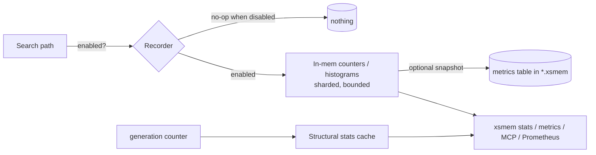

# xs-memory — Design Addendum 3: Optional Metrics & Observability

> Addendum to `docs/xs-memory-design.md` (base) and Addenda 1–2.
> Adds an **optional, privacy-by-design, local-only** metrics subsystem to `xsmem`.
>
> - Status: Draft (v0.1)
> - Naming: project `xs-memory`, CLI/binary `xsmem`, store `*.xsmem/`, package `xsmem` (post-rename from small-memory/smem).
> - Depends on: base §8.4 (EXPLAIN / `stats`), Addendum 1 (usage capture), Addendum 2 §1.1 (hashed-token capture), §2.3 (generation counter), §2 (cache hit-rate), §3 (grep lane).

---

## 0. Scope & principles

Add the following **optional** metrics:

1. Search count — total and per-(collection, mode).
2. Search keywords / query text — privacy-by-design; stored as **hashed tokens** (shares the tuning salt).
3. Per-query hit rate — results returned vs requested `topK`.
4. Search latency — **coarse buckets only, no precise timing** (see §0.1).
5. Mode distribution — FTS vs Vector vs Hybrid (vs Grep) usage.
6. Index-level stats — FTS term count, vector index size, graph edge count.

Design principles (consistent with base non-negotiables):

- **Optional and off by default.** When disabled, the hot path uses a no-op recorder — a single atomic check, zero allocation, zero measurable overhead. "Optional" is enforced at the type level, not just config.
- **Local-only.** Metrics never leave the machine unless the operator explicitly wires an exporter. No phone-home.
- **Privacy-by-design.** No raw query text is stored by default. Keyword metrics reuse the tuning subsystem's hashed tokens (Addendum 2 §1.1).
- **Bounded.** Fixed dimensions (few collections × ≤4 modes), fixed histogram buckets, bounded+decayed top-K term table. No cardinality explosion, counts toward the global memory budget (base N2).
- **Reuse, don't duplicate.** One capture path feeds both the tuning model and metrics; structural stats are cached by the generation counter so they recompute only after writes.

### 0.1 Note on "Search latency (no timing)"

The request lists *latency* but annotates it *no timing*, which is contradictory. Interpretation chosen: **capture latency only as coarse, bucketed counts (a histogram), never as wall-clock timestamps or precise per-call durations**, and ship it **disabled by default**. This honors both readings — you get a latency signal if you opt in, but no fine-grained timing is recorded, and if "no timing" means *omit latency entirely*, the feature is a one-flag no-op (`metrics.search.latency = false`, the default). Flag for confirmation: if you want latency fully removed rather than off-by-default-bucketed, say so and §1.4 is dropped.

---

## 1. Per-metric design

A small in-process **metrics registry** holds counters, gauges, and histograms with bounded label sets. The registry is a no-op when `metrics.enabled = false`.

```go
type Metrics interface {
    Search(collection string, mode Mode, returned, requested int, lat time.Duration)
    Term(collection string, tokens []TermID)   // hashed tokens (shared with tuning)
    // structural stats are pulled lazily, not pushed
}
type nopMetrics struct{} // used when disabled; every method is a no-op
```

### 1.1 Search count (total / per-collection / per-mode)

Monotonic counters keyed by `(collection, mode)`. Total is the sum. Bounded cardinality (collections are few; modes ∈ {fts, vector, hybrid, grep}). O(1) atomic increment on the search path.

### 1.2 Search keywords (hashed, privacy-by-design)

A **decayed top-K term-frequency table** of *hashed* analyzer tokens (not raw text), sharing the tuning salt (Addendum 2 §1.1) so capture happens once. Bounded to `top_k` entries with time decay; smallest evicted. By default the histogram is keyed by token **hash**, so even local inspection doesn't reveal raw queries. `metrics.keywords.store_raw = true` is an explicit, local-only opt-in for human-readable terms (it's the operator's own machine) — off by default. No full query strings are ever stored.

### 1.3 Per-query hit rate (returned vs requested topK)

For each query record `(returned, requested)`. Aggregate as:
- `fill_rate = Σ returned / Σ requested` per (collection, mode), and
- an **underfilled-query counter** (`returned < requested`), which flags poor recall, an over-narrow filter, or a small corpus.

Cheap (two integers per query). Complements tuning: a persistently low fill rate for a collection is a signal to widen query expansion (Addendum 2 §1.4).

### 1.4 Search latency (coarse buckets, no precise timing)

*Default off (see §0.1).* When enabled, a fixed-bucket histogram measured with a monotonic clock around the search call:

```
buckets (ms): ≤1, ≤5, ≤10, ≤25, ≤50, ≤100, ≤250, ≤500, >500
```

Only bucket counts are stored — no timestamps, no per-call durations, no min/max with identifying queries. Overhead when enabled is one monotonic read + one bucket increment.

### 1.5 Mode distribution

A derived view over §1.1: the share of searches per mode (fts/vector/hybrid/grep). No extra capture — computed from the search counters. Useful to see whether a collection leans semantic vs lexical, and whether the optional grep lane (Addendum 2 §3) is actually being used.

### 1.6 Index-level structural stats

Pulled lazily (not event-driven) and **cached by the per-collection generation counter** (Addendum 2 §2.3) so they recompute only after a write:

| Stat | Source | Notes |
|---|---|---|
| FTS term count | dictionary/FST size across live segments | unique terms; cached (counting is non-trivial) |
| Vector index size | vector count, bytes, dims, quantization | from the vector index metadata |
| Graph edge count | triple store (SPO index) | live edges, excluding tombstoned |
| (also) chunks / memories / segments / tombstones | metadata store | rounds out `stats` |
| (also) cache hit-rate, tuning model size | Addenda 2 | unified view |

Because these are cached by generation, repeated `xsmem stats` calls are O(1) between writes.

---

## 2. Storage, overhead & lifecycle



- **Capture**: sharded counters (cheap locks / atomics) on the hot path; histograms are fixed-bucket arrays.
- **Persistence**: `metrics.persist = true` snapshots to a `metrics` table in the store on a cadence and at `Close()`; `false` keeps metrics in-memory only (zero disk).
- **Retention / reset**: `metrics.retention` window; `xsmem metrics reset [--collection c]`.
- **Decay**: the keyword top-K table decays on the tuning job's schedule (shared cadence).
- **Memory**: bounded label sets + fixed buckets + bounded top-K → fits the global budget (N2).

---

## 3. Exposure

- **`xsmem stats`** (human-readable) — extended with the new aggregates and the structural stats (§1.6). The base observability view (§8.4) becomes the one-stop summary.
- **`xsmem metrics [--json] [--collection c] [--reset]`** — machine-readable snapshot for scripting/CI.
- **MCP tool `memory_metrics`** — lets the driving agent introspect (e.g., the `/xs-memory` skill can report "you've run 40 hybrid searches; fill rate 0.7").
- **Daemon `/metrics` (Prometheus text), opt-in** — `metrics.export.prometheus = true`, daemon mode only. Pure-Go text formatting (no heavy dependency, no CGO). Off by default.

---

## 4. Configuration

```toml
[metrics]
enabled   = false       # OPTIONAL; off by default → no-op recorder, zero hot-path cost
persist   = true        # snapshot to *.xsmem; false = in-memory only
retention = "30d"

[metrics.search]
count             = true    # per (collection, mode)
hit_rate          = true    # returned vs requested topK + underfilled counter
mode_distribution = true    # derived from count
latency           = false   # coarse buckets only; NO precise timing; off by default (§0.1)

[metrics.keywords]
enabled   = true
hashed    = true        # privacy-by-design; shares the tuning salt (Addendum 2 §1.1)
store_raw = false       # local-only opt-in for readable terms
top_k     = 200         # bounded + decayed

[metrics.index]
enabled = true          # structural stats; cached by generation counter

[metrics.export]
prometheus = false      # daemon-only opt-in endpoint
```

---

## 5. Privacy & security

- **No raw queries stored** unless `keywords.store_raw = true` (explicit, local-only). Default is hashed tokens, identical to the tuning privacy model.
- **No precise timing / timestamps** (§0.1) — only bucket counts.
- **Local-only**; the Prometheus endpoint is off by default and daemon-scoped.
- **slog never logs** raw queries, hashes' salt, API keys, or PII (base §8 logging rules).
- Metrics are **descriptive, not identifying**: counts and distributions, not per-event records tied to content.

---

## 6. Testing & acceptance

- **Disabled = zero overhead**: with `metrics.enabled = false`, the recorder is the no-op type; a benchmark asserts no allocations and no measurable latency delta on the search path.
- **Privacy**: a test asserts no raw query string is ever persisted when `store_raw = false`; keyword entries are hashes only.
- **No timing**: a test asserts no wall-clock timestamps or sub-bucket durations are stored when latency is enabled (buckets only).
- **Counts/hit-rate correctness**: search counters and `returned/requested` aggregates match a scripted sequence; underfilled counter fires when `returned < requested`.
- **Mode distribution**: sums to total; includes grep lane.
- **Structural stats**: FTS term count / vector size / graph edges match an oracle on a seeded store; cached value is reused between writes and recomputed after a write (generation-counter test).
- **Bounded**: top-K term table never exceeds `top_k`; decays on schedule.
- **Exposure**: `xsmem metrics --json` is valid JSON; `memory_metrics` MCP tool returns the same snapshot; Prometheus output parses when enabled.
- **Reset**: `xsmem metrics reset` clears aggregates.

**Definition of Done**
- Metrics are genuinely optional: disabled by default, no-op recorder, proven zero overhead.
- Privacy-by-design proven: hashed tokens only by default, no raw queries, no precise timing.
- All six metrics correct against oracles; structural stats cached by generation counter.
- Exposed via `xsmem stats`/`metrics`, `memory_metrics`, and optional Prometheus.
- Pure Go, `CGO_ENABLED=0` for all targets; `make fmt lint test` green with `-race`.

---

## 7. Decision log (this addendum)

| # | Decision | Rationale |
|---|---|---|
| M1 | Off by default with a no-op recorder type | "Optional" enforced at the type level; zero cost when unused. |
| M2 | Keyword metrics reuse tuning's hashed tokens | Single capture path; privacy-by-design; no raw text. |
| M3 | Latency = coarse buckets, no timestamps, default off | Resolves the "(no timing)" annotation; honors both readings (§0.1). |
| M4 | Mode distribution derived from search counts; includes grep | No extra capture; surfaces grep-lane adoption (Addendum 2 §3). |
| M5 | Structural stats pulled lazily, cached by generation counter | Counting unique terms is costly; recompute only after writes. |
| M6 | Local-only; Prometheus export opt-in, daemon-scoped | No phone-home; observability without leaking data. |
| M7 | Bounded dimensions + fixed buckets + bounded top-K | Cardinality and memory stay within the global budget (N2). |

---

*Open questions: (a) confirm the "(no timing)" intent — bucketed-and-off-by-default (current) vs latency removed entirely; (b) whether `store_raw` should require a second confirmation flag given it changes the privacy posture; (c) whether to expose a tiny per-collection "health" rollup (fill rate + mode mix + cache hit-rate) directly to the agent via the skill.*