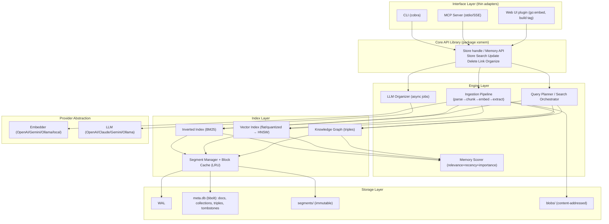

# xs-memory Design Document

> A document/file indexing and search engine for AI agents running in local environments.
> A lightweight, multi-platform, embeddable memory engine aiming to be "SQLite for AI Agents."

- Status: Draft (v0.1)
- Target language: Go (1.22+)
- Author role: Principal Software Engineer

---

## 1. Overview, Goals, and Non-Goals

### 1.1 One-liner
An embedded memory engine that enables local AI agents to "remember, organize, recall, update, and forget" — all within a single binary.

### 1.2 Goals
- **Embedded-first**: Runs as a single binary/library like SQLite. No external servers or services required.
- **Lightweight & multi-platform**: Pure Go, single binary. Linux / macOS / Windows, amd64 / arm64.
- **Runs within a memory budget**: Does not load the entire index into RAM. On-demand loading + LRU offload to disk.
- **Three search modes + graph**: Full-text search (BM25), vector search (ANN/flat), hybrid (RRF), and a small-scale knowledge graph.
- **Agent memory vocabulary**: Not just search — recency, importance, consolidation, and forgetting are first-class features.
- **Two interfaces**: CLI and MCP. Web UI is a plugin (separated by build tag).
- **LLM is optional**: OpenAI / Claude / Gemini / Ollama are interchangeable. Operates in degraded mode without one.
- **CJK as first-class**: Japanese tokenization (morphological analysis) is handled correctly by default.

### 1.3 Non-Goals (at least for v1)
- Distributed, multi-node, horizontal scaling. That's not "small."
- Ultra-large-scale ANN with hundreds of millions of vectors.
- Replacing general-purpose RDB/OLAP.
- Multi-tenant SaaS. This is strictly for local single-user (multiple agents) use.

### 1.4 Scale Targets (local laptop baseline)
| Metric | Target |
|---|---|
| Memory record count | ~1,000,000 chunks |
| Search latency (p95) | < 100ms (hybrid, within memory budget) |
| Default memory budget | 256MB (configurable) |
| Startup time | < 200ms (indexes are lazy-loaded) |
| Binary size | < 30MB (without Web UI) |

---

## 2. Design Principles

1. **SQLite mental model**: `Open(path) → handle → operations → Close`. The store is a set of files (or a directory). Portable by copying.
2. **Core is a library**: CLI / MCP / Web UI are thin adapters. They all call the same Go package `xsmem`.
3. **Progressive complexity**: Start with something simple and correct (flat vector, brute force) → add HNSW etc. only after measuring.
4. **Explicit memory budget control**: Don't rely on OS page cache. Maintain a self-managed block cache with guaranteed upper bounds (cross-platform reproducibility).
5. **LLM is async, optional, and swappable**: Never place LLM on the critical path.
6. **Don't break**: WAL + immutable segments + checksums. Recovery via replay after a crash.
7. **Observability**: Structured logging, metrics, `xsmem stats`, and EXPLAIN-equivalent query plan output.

---

## 3. Key Design Decisions (Decision Log)

| # | Topic | Decision | Rationale / Trade-offs |
|---|---|---|---|
| D1 | Storage foundation | **Pure Go (bbolt + custom segments)** | Single binary and cross-compilation are top priorities. Alternative: CGO SQLite + FTS5 + sqlite-vec is faster to implement but degrades the build experience due to CGO dependency. `storage` is interface-abstracted for future replacement. |
| D2 | Process model | **Embedded (single writer) + optional daemon** | Concurrent agents / MCP / WebUI are consolidated into a single daemon to avoid multi-writer problems. Avoids SQLite's file-lock hell. |
| D3 | Index residency | **Segments + block cache LRU** | Core of the "don't load everything into memory" requirement. Only dictionaries/metadata are resident; data blocks are loaded on demand. |
| D4 | Vector ANN | **Start with flat + quantization; HNSW comes later** | At small scale, SIMD brute force is fast enough and segment merging is straightforward. Defer IVF/HNSW until scale demands it. |
| D5 | Hybrid fusion | **RRF (Reciprocal Rank Fusion) as default** | No score normalization needed; robust. Weighted linear combination is an option. |
| D6 | Tokenizer | **Kagome (Japanese morphological analysis) + pluggable language-specific analyzers** | Don't retrofit CJK later. English uses a standard analyzer; fallback is bigram. |
| D7 | LLM integration | **Async jobs + provider interface** | Removed from the ingestion critical path. Can run entirely locally with Ollama. |
| D8 | Store format | **Directory (`*.xsmem/`) + archive transport** | Segment design pairs well with directories. Single-file transport is provided via export/import (tar). |
| D9 | Schema | **Collections (namespaces) + loose metadata (JSON)** | Per-agent/project isolation = equivalent to SQLite's "tables." |

---

## 4. Overall Architecture



Layers depend only downward. The interface layer knows only `xsmem` and never touches the engine layer directly.

---

## 5. Data Model

### 5.1 Core Entities

**Collection (namespace)** — Isolation boundary per agent/project. Analyzer, embedding model, dimensions, and scoring weights are fixed per collection (the constraint that dimensions cannot be changed later is explicit).

**Memory (record)**
```go
type Memory struct {
    ID         ULID                 // time-sortable
    Collection string
    Content    string               // body (large content uses BlobRef)
    BlobRef    *Hash                // content-addressed (optional)
    ContentType string              // text/plain, text/markdown, text/x-go ...
    Source     string               // file://..., conversation:session-123 ...
    Type       MemoryType           // episodic / semantic / procedural
    Metadata   map[string]any       // tags, agent_id, session_id, arbitrary
    Importance float32              // 0..1 (LLM or explicit)
    CreatedAt, UpdatedAt, AccessedAt time.Time
    AccessCount uint32
    Chunks     []ChunkID            // child chunks
}
```

**Chunk (search unit)** — Search and vectors operate at chunk granularity. Linked to a parent Memory.
```go
type Chunk struct {
    ID       ChunkID
    MemoryID ULID
    Ord      int
    Text     string
    Vector   []float32   // or quantized representation
    Tokens   int
}
```

**Triple (graph)** — `(subject, predicate, object)`. subject/object is either an EntityID or MemoryID.
```go
type Triple struct {
    S, P, O EntityRef
    Weight  float32
    Source  ULID   // originating Memory
}
```

### 5.2 Memory Type Semantics (Agent Memory)
- **episodic**: Conversations and events. Strong temporal aspect; recency-weighted. Primary target for consolidation/forgetting.
- **semantic**: Facts and knowledge. Easily promoted to the graph. Stable.
- **procedural**: Procedures and skills (a coding agent's "how-to").

> Design decision: Types are **hints** for adjusting search scoring (strength of time decay) and organizer job behavior — not a strict type system.

---

## 6. Storage Layer (Core Requirement: On-demand Loading + LRU Offload)

### 6.1 File Layout
```
mystore.xsmem/
├── manifest.json        # schema version, collection definitions, embedding model/dimensions
├── meta.db              # bbolt: Memory metadata, Collection, Triple indexes (SPO/POS/OSP), tombstones
├── wal/                 # write-ahead log (for recovery)
│   └── 000123.wal
├── segments/            # immutable index segments
│   ├── 00001.seg        #   term dict (FST) + postings + vectors + per-segment metadata
│   └── 00002.seg
├── vectors/             # (optional) separated quantized vector data
└── blobs/               # large content bodies (SHA-256 content-addressed)
```
Transport via `xsmem export store.tar` to bundle into a single file (preserving the SQLite single-`.db` experience).

### 6.2 Write Path (LSM-style)
1. Writes are **appended to the WAL** → following the fsync policy (configurable as `synchronous=normal/full` equivalent).
2. Simultaneously reflected in the in-memory **mutable segment (memtable)**. Search spans the memtable + existing segments.
3. When the memtable exceeds a threshold (count or bytes), it is **flushed to an immutable segment** → WAL is truncated.
4. Background **compaction** merges small segments, keeps segment count low, and physically reclaims tombstones.

### 6.3 On-demand Loading + Block Cache (LRU)
- Each segment's **resident portion**: term dictionary (FST) and vector index metadata (offset table). This is small.
- **Data portion** (posting blocks, vector blocks) is stored on disk in **block units** and loaded on access.
- A global **BlockCache** enforces a memory budget (default 256MB) with **LRU eviction**. On a miss, data is read from disk via `pread` (or mmap, see below).
- This achieves "only hot blocks are resident in RAM, not the entire index."

```
[Query] → SegmentManager → BlockCache(LRU)
                              │ hit → return block
                              │ miss → read from seg file → insert(LRU evict) → return
```

> **mmap vs explicit read decision**: mmap is easier to implement and leverages the OS page cache, but memory usage upper bounds are platform-dependent and hard to reproduce, with behavioral differences on Windows. **Explicit read + self-managed LRU is the default**; `--mmap` is an advanced option (aligned with D4/Principle 4).

### 6.4 Deletion and Update
- Deletion uses **tombstones** (deletion markers in meta.db). Excluded during search; physically reclaimed during compaction.
- Update is "add new version + tombstone old version." Vector dimension changes are not allowed (collection rebuild required).

### 6.5 Durability
- Crash recovery via WAL replay. CRC32C on each segment and WAL record.
- bbolt itself is ACID, so metadata, graph, and tombstones are consistent.
- `Close()` flushes and updates the manifest.

---

## 7. Index Layer

### 7.1 Full-Text Search (Inverted Index, BM25)
- **Analyzer pipeline**: Normalization (NFKC) → Tokenize → Lowercase → Stop words (per-language, optional) → Synonyms (optional).
- **Tokenizers**:
  - Japanese/CJK: **Kagome v2** (morphological). Dictionary bundled, pure Go.
  - English etc.: Unicode word boundaries.
  - Fallback: Character bigrams (enables search even for unknown languages).
  - Fixed per collection (D6).
- **Dictionary**: FST (Finite State Transducer) for memory-efficient prefix and fuzzy matching.
- **Ranking**: BM25 (configurable k1, b parameters). Field boosting (title/body/tag) supported.
- **Filters**: Metadata pre-filters (bbolt index or bitmap). `tag:`, `agent_id:`, date range, etc.

### 7.2 Vector Search
- **Phase 1 (MVP): flat + quantization**
  - Distance: cosine / dot.
  - Quantization: Scalar quantization (int8) as default; `float32` also selectable. 1M × 768 dim in int8 is ~768MB → managed via block-based caching.
  - SIMD: `chewxy/math32` etc. + hand-written dot product. Brute force is fast enough at tens of thousands scale (~ms).
  - Stored per segment → top-k per segment → merge. Trivial merging is a flat index advantage.
- **Phase 2: ANN (at scale)**
  - HNSW (pure Go implementation or custom). However, segment merging is difficult, so switch to "single global HNSW with vector data on disk + cache."
  - For even larger scale: IVF + PQ (cluster-based block reads) for disk-friendly access.
- **Re-ranking (optional)**: Cross-encoder or LLM refinement of top N (off by default).

### 7.3 Knowledge Graph (Small-scale)
- **Triple store**: bbolt with SPO / POS / OSP indexes for O(log n) traversal in any direction.
- **Scale assumption**: ~hundreds of thousands of edges. Default assumes in-memory adjacency lists can be loaded; falls back to indexed traversal beyond that.
- **Provenance tracking**: Each edge retains the source Memory (explainability / deletion propagation).
- **Use case**: Graph expansion of search results (a memory → related entities → related memories) and supplying structured context to agents.

---

## 8. Search Layer (Query Planner + Agent Scoring)

### 8.1 Query Specification
```go
type Query struct {
    Collection string
    Text       string            // for FTS / embedding generation
    Vector     []float32         // explicit vector (optional)
    Mode       Mode              // FTS | Vector | Hybrid | GraphExpand
    Filter     Filter            // metadata, date range, type, tag
    TopK       int
    Fusion     FusionOpts        // RRF (default) | Weighted{alpha}
    Scoring    ScoringOpts       // recency/importance weights, time decay half-life
    GraphHops  int               // 0 = disabled
    Rerank     bool
}
```

### 8.2 Hybrid Fusion
- Default **RRF**: `score(d) = Σ 1/(k + rank_i(d))` (k=60 default). Uses only FTS and Vector ranks; no score normalization needed.
- Alternative **Weighted**: `α·norm(bm25) + (1-α)·sim`. Requires min-max normalization of score distributions; fragile, so not the default.

### 8.3 Agent Memory Scoring
The final score combines not just search relevance but also agent-memory-specific factors (inspired by Generative Agents / MemGPT):

```
final = w_rel·relevance
      + w_rec·recency(now, accessed_at; half_life)
      + w_imp·importance
```
- `recency` uses exponential decay (half-life set per type: short for episodic, long for semantic).
- `importance` is LLM-scored or explicitly set.
- This naturally sinks "relevant but old and unimportant memories."

### 8.4 Query Plan Output (EXPLAIN)
`xsmem search --explain` outputs "which segments were touched, cache hit rate, per-stage latency, pre- and post-fusion scores." Essential for tuning and reliability.

---

## 9. Ingestion Pipeline

```
Input → Extract (parse) → Normalize → Chunk → Embed → Index → (async) Organize
```

- **Extractors (pluggable)**: txt / md / html / json / source-code / PDF.
  - PDF is text extraction only (OCR is v2; avoids external dependencies).
- **Chunking strategies**:
  - Text: Sentence/paragraph boundaries + overlapping token windows.
  - **Code-aware chunking**: tree-sitter (go-tree-sitter) for function/class/symbol-level splitting. A differentiating feature for coding agents.
  - Markdown: Respects heading hierarchy.
- **Embedding**: Via provider abstraction (§11). Batching, rate control, retries. On failure, index FTS first; embeddings go to a retry queue (degraded operation).
- **Idempotency**: Same source + content hash skips or updates on re-ingestion (prevents wasted re-indexing).

---

## 10. LLM Organizer (Organization, Consolidation, Forgetting)

An **async job worker** removed from the critical path. Search works even without LLM configuration.

| Job | Description | Default Timing |
|---|---|---|
| **Entity/relation extraction** | Text → triples → graph injection | Post-ingestion (batch) |
| **Auto-tag/classification** | Enrich metadata, infer Type | Post-ingestion |
| **Importance scoring** | importance 0..1 | Post-ingestion |
| **Duplicate detection/consolidation** | Vector-neighbor near-dup detection → LLM consolidation summary | Periodic |
| **Summary/consolidation** | Promote episodic group → 1 semantic record | Periodic / threshold |
| **Forgetting** | Retire memories with low importance × low recency × TTL (archive or delete) | Periodic |

- All jobs are **explainable**: retain source memories and change history. Auto-deletion defaults to soft (archive).
- Prompts are templated, requesting structured output (JSON) → strict parsing.
- Failure, cost limits, and concurrency are configuration-controlled.

> Design decision: The index LRU "forgetting" (§6.3, eviction for performance) and **semantic forgetting** (this job, retiring low-value memories) are explicitly separated as distinct concepts. Conflating them leads to data-loss bugs.

---

## 11. Provider Abstraction

```go
type Embedder interface {
    Embed(ctx, texts []string) ([][]float32, error)
    Dim() int
    ID() string // model identifier (pinned to collection)
}

type LLM interface {
    Complete(ctx, req Request) (Response, error) // JSON mode, no tools
}
```
Implementations: `openai`, `anthropic`, `gemini`, `ollama` (local), `mock` (for testing).

- Provider selection via configuration. **Ollama recommended as default** (local-only, privacy).
- Embedding model and its dimensions are **stamped onto the collection** to prevent subsequent inconsistencies.
- API keys come from config files / environment variables / OS keychain (optional). **Never log keys in logs or URLs.**

---

## 12. Process Model and Concurrency

- **Embedded mode (default)**: In-process as a library. Single process, single writer (RWMutex). Multiple readers allowed.
- **Daemon mode**: `xsmem serve` — one process owns the store and listens on a Unix domain socket (named pipe on Windows).
  - MCP server, Web UI, and multiple agents connect here → physically eliminates multi-writer problems (D2).
- File lock: An exclusive lock file is placed in the store directory to detect double-opens.
- Writes are serialized through the WAL. Reads are nearly lock-free due to segment immutability.

---

## 13. Interfaces

### 13.1 CLI (cobra)
```
xsmem init <store> [--collection default --embedder ollama:nomic-embed-text]
xsmem add  <store> --collection c [file... | -]   # stdin supported
xsmem search <store> "query" [--mode hybrid --topk 10 --explain --filter tag=foo]
xsmem get  <store> <id>
xsmem update <store> <id> ...
xsmem rm   <store> <id>
xsmem link <store> <s> <predicate> <o>            # manual graph edge
xsmem ls   <store> [--collection c]
xsmem organize <store> [--jobs dedup,extract]     # manual organizer invocation
xsmem serve <store> [--socket ...]                 # daemon
xsmem mcp   <store>                                # MCP (stdio) server
xsmem import/export <store> <archive.tar>
xsmem stats <store>                                # counts, segments, cache hit rate
xsmem compact <store>
```

### 13.2 MCP Server
- Default **stdio** transport (supported by most coding/agent platforms). HTTP/SSE is optional.
- Library: `mark3labs/mcp-go` or official Go SDK.

Exposed tools (examples):
| Tool | Description |
|---|---|
| `memory_store` | Store a memory (content, metadata, collection) |
| `memory_search` | Search (mode, filter, topk) |
| `memory_get` | Get by ID |
| `memory_update` / `memory_delete` | Update / Delete |
| `memory_link` | Create graph edge |
| `memory_list` | List / Browse |
| `memory_organize` | Trigger organizer jobs |

Resources: Each collection is exposed as an MCP resource, allowing agents to list and reference them.

> Safe defaults: MCP `delete` defaults to soft deletion (tombstone/archive). Physical deletion requires an explicit flag.

### 13.3 Web UI (Plugin)
- The daemon exposes REST + WebSocket. SPA is bundled via `go:embed`.
- Separated by **build tag `webui`** → the default binary stays lightweight (meeting binary size targets).
- Use cases: Memory browsing, search, graph visualization, organizer monitoring.

---

## 14. Configuration

Priority: Flags > Environment variables > Config file (TOML) > Defaults.
```toml
[store]
path = "~/.xsmem/default.xsmem"

[memory]
block_cache_mb = 256
mmap = false

[search]
fusion = "rrf"           # rrf | weighted
rrf_k = 60
[search.scoring]
w_relevance = 0.6
w_recency   = 0.25
w_importance = 0.15
half_life_episodic = "72h"

[embedder]
provider = "ollama"
model    = "nomic-embed-text"

[llm]
provider = "ollama"
model    = "llama3.1"
max_jobs = 2

[ingest]
chunk_tokens = 512
chunk_overlap = 64
analyzer = "ja"          # ja | en | bigram
```

---

## 15. Technology Stack (Candidates)

| Role | Library | Notes |
|---|---|---|
| CLI | `spf13/cobra` | Standard |
| Meta/Graph KV | `go.etcd.io/bbolt` | Single file, ACID, mmap B+tree |
| Japanese morphology | `ikawaha/kagome` (v2) | Pure Go, dictionary bundled |
| FST dictionary | `blevesearch/vellum` | Memory-efficient term dict |
| Code chunking | `go-tree-sitter` | Symbol-level splitting (CGO dependency is a concern; pure Go alternatives exist) |
| Vector numerics | Custom SIMD / `gonum` | int8 quantized dot product |
| ID | `oklog/ulid` | Time-sortable ID |
| MCP | `mark3labs/mcp-go` / official SDK | stdio |
| Serialization | FlatBuffers / protobuf | Segment data (zero-copy oriented) |
| Logging | `log/slog` | Standard, structured |

> Note: `go-tree-sitter` requires CGO, conflicting with D1 (pure Go, single binary). Code-aware chunking is **made optional via build tag `treesitter`**; the default is regex/indent-based simple splitting.

---

## 16. Package Layout (Go)

```
xs-memory/
├── cmd/xsmem/                 # CLI entry point
├── xsmem/                     # Public Core API (Open, Store, Search ...)
├── internal/
│   ├── storage/              # WAL, segment, blockcache (LRU), bbolt wrapper
│   ├── index/
│   │   ├── fts/              # Inverted index, BM25, analyzer integration
│   │   ├── vector/           # flat/quantize/(hnsw)
│   │   └── graph/            # triples, traversal
│   ├── ingest/               # parse, chunk, pipeline
│   ├── search/               # planner, fusion, scorer
│   ├── organizer/            # async jobs, prompts
│   ├── provider/             # embedder, llm implementations
│   └── analyzer/             # ja/en/bigram
├── interfaces/
│   ├── mcp/                  # MCP server
│   └── web/                  # Web UI (build tag webui)
└── docs/
```
- Everything except `xsmem` is hidden under `internal/`. Protects the stable API.
- `storage.Engine`, `provider.Embedder/LLM`, `analyzer.Analyzer` are interface-abstracted (swappable/testable).

---

## 17. Roadmap

### MVP (v0.1) — "Can Remember"
- Embedded library + CLI (init/add/search/get/rm/ls).
- Pure Go storage: WAL + segments + bbolt metadata.
- Full-text search (BM25, Kagome/en/bigram).
- Vector: flat + int8 quantization.
- Hybrid: RRF.
- Block cache LRU + memory budget.
- Embedder: Ollama / OpenAI.

### v0.2 — "The Agent's Mouth"
- MCP server (stdio) + daemon mode.
- Recency/importance scoring.
- Idempotent ingestion, metadata filters.
- import/export, stats, compact, EXPLAIN.

### v0.3 — "Organize and Get Smarter"
- LLM organizer (extraction/tagging/dedup consolidation/summarization).
- Knowledge graph + GraphExpand search.
- LLM provider: Claude / Gemini additions.

### v1.0 — "Polish"
- Web UI plugin (graph visualization).
- Code-aware chunking (tree-sitter, optional).
- Forgetting job, re-ranking.
- Full benchmark/fuzz/crash recovery test suite.

### v2 Candidates
- Switch to HNSW/IVF-PQ (large scale). OCR. Encrypted store. Differential sync.

---

## 18. Risks and Open Questions

1. **CGO boundary**: Kagome (pure Go, OK) is not an issue, but tree-sitter requires CGO. To maintain the pure Go single binary flag, code splitting defaults to a simple version. → Separated by build tag (decided).
2. **Vector memory budget**: 1M × 768 in int8 is ~768MB. With the default 256MB budget, block eviction will be frequent, increasing latency. → Document guidelines for PQ compression or collection splitting. Have `xsmem stats` emit a warning suggesting "migration to HNSW/PQ" at threshold.
3. **Multi-process**: Accidental double-opening of a store in embedded mode. → Exclusive lock + clear error message. Document daemon recommendation.
4. **Embedding model inconsistency**: Changing the model later alters dimensions/distribution. → Stamp onto collection and prohibit changes; provide a rebuild command.
5. **LLM organization non-determinism/cost**: Concern that auto-consolidation and auto-deletion could corrupt data. → Default soft deletion + provenance retention + dry run (`--dry-run`).
6. **CJK beyond Japanese / mixed text**: Chinese, Korean, code-mixed text. → Bigram fallback + language detection consideration (v2).

---

## Appendix A: Public API Sketch

```go
package xsmem

type Store struct{ /* ... */ }

func Open(path string, opts ...Option) (*Store, error)
func (s *Store) Close() error

func (s *Store) CreateCollection(name string, cfg CollectionConfig) error

func (s *Store) Remember(ctx context.Context, m Memory) (ULID, error)
func (s *Store) Search(ctx context.Context, q Query) ([]Result, error)
func (s *Store) Get(ctx context.Context, id ULID) (Memory, error)
func (s *Store) Update(ctx context.Context, id ULID, patch Patch) error
func (s *Store) Forget(ctx context.Context, id ULID, hard bool) error
func (s *Store) Link(ctx context.Context, t Triple) error
func (s *Store) Organize(ctx context.Context, jobs ...JobKind) error

type Result struct {
    Memory   Memory
    Score    float32
    Subscores Subscores // relevance/recency/importance/fusion rank
    Explain  *PlanTrace // when --explain is used
}
```

---

*This design is a v0.1 draft. In particular, §6 (storage/LRU), §7.2 (vector strategy), and §10 (organizer auto-deletion policy) are expected to be revised after implementation and measurement.*
